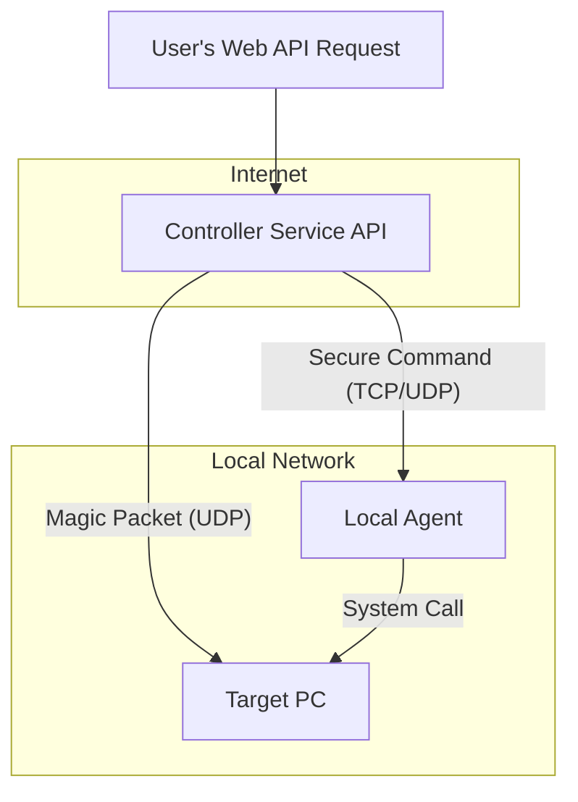

# Project Design: A Universal Smart Home PC Controller

## 1. Vision

The goal of this project is to provide a secure and reliable way to control a personal computer (PC) using ~~standard smart home voice assistants and applications (e.g., Google Assistant, Amazon Alexa, Apple HomeKit)~~ Web APIs. The core user experience is seamless integration, allowing users to perform actions like turning their PC on or off as if it were any other smart device.

This design is intended to be platform-agnostic, outlining a system architecture that can be implemented using various technologies and adapted for different operating systems and host environments (e.g., cloud servers, Raspberry Pi, embedded devices).

## 2. Core Architecture

The system is composed of three main components that work together to process a user's command and execute it on the target PC.

### Component Breakdown

1.  ~~**Smart Home Platform (e.g., Google/Alexa Cloud)**~~
    *   ~~**Role:** Handles voice recognition, user authentication (OAuth 2.0), and intent processing. It's the public-facing entry point.~~
    *   ~~**Function:** When a user says, "Hey Google, turn on my PC," the platform authenticates the user, identifies the target device, and sends a standardized `EXECUTE` command to a pre-configured webhook URL.~~
    *   ~~**Key Intents:** It communicates with our service using three primary intents:~~~
        *   ~~`SYNC`: Asks the Controller Service which devices are available for this user.~~
        *   ~~`QUERY`: Asks the Controller Service for the current status of a device (e.g., is it on or off?).~~
        *   ~~`EXECUTE`: Tells the Controller Service to perform an action on a device (e.g., turn it on).~~

2.  **Controller Service (The Brain)**
    *   **Role:** A web service that acts as the central hub, translating ~~smart home platform~~ web API commands into specific network actions.
    *   **Function:** It exposes a secure HTTPS endpoint to receive web API requests. It maintains the configuration details for the target PC, such as its MAC address and IP address.
    *   **Platform Independence:** This service can be hosted anywhere with an internet connection—a cloud provider (AWS, Azure, GCP), a home server, a Raspberry Pi, or a NAS. It can be written in any backend language (e.g., .NET, Go, Node.js, Python).

3.  **Local Agent (The Hands)**
    *   **Role:** A lightweight and secure listener running on the target PC.
    *   **Function:** Its sole purpose is to listen for specific commands (like "shutdown" or "reboot") from the Controller Service on a dedicated network port. Upon receiving a valid command, it executes the corresponding system-level action.
    *   **Platform Independence:** This is the key to supporting multiple platforms:
        *   **Windows:** Can be a PowerShell script, a Windows Service, or a small .NET console app.
        *   **Linux:** Can be a simple shell script (e.g., Bash) managed by a `systemd` service.
        *   **macOS:** Can be a script managed by a `launchd` agent.
        *   **Embedded/TV:** Can be a small, compiled binary or a background service, provided the OS grants the necessary permissions to listen on a port and execute shutdown commands.

## 3. Core Actions & Communication Protocols

### Action: Power On

*   **Mechanism:** Wake-on-LAN (WoL).
*   **Flow:**
    1.  The Controller Service receives an "ON" command.
    2.  It constructs a special "magic packet" containing the target PC's MAC address repeated 16 times.
    3.  This UDP packet is sent to the broadcast address of the local network (e.g., 192.168.1.255).
*   **Prerequisites:** The target PC's motherboard (BIOS/UEFI) and network interface card must be configured to allow Wake-on-LAN.

### Action: Power Off / Reboot

*   **Mechanism:** A secure command sent to the Local Agent.
*   **Flow:**
    1.  The Controller Service receives an "OFF" or "REBOOT" command.
    2.  It sends a predefined, secure message (e.g., "SHUTDOWN_NOW") over TCP or UDP to the Local Agent's IP address and port.
    3.  The Local Agent receives the message, validates it, and executes the appropriate command-line instruction (e.g., `shutdown /s /t 0` on Windows or `shutdown now` on Linux).

### Action: Status Query

*   **Mechanism:** A simple network probe.
*   **Flow:**
    1.  The Controller Service receives a status query request.
    2.  It attempts to establish a connection to an open port on the target PC (this could be the Local Agent's port or another known port like RDP/3389).
    3.  If the connection succeeds within a short timeout, the PC is considered **online**.
    4.  If the connection fails or times out, the PC is considered **offline**.

## 4. Security Considerations

1.  **Authentication:** ~~The connection between the Smart Home Platform and the Controller Service **must** be secured using OAuth 2.0 to ensure that only authorized users can access the service.~~ All web API endpoints should be secured to prevent unauthorized access.
2.  **Secure Transport:** The Controller Service API endpoint **must** use HTTPS to encrypt all traffic.
3.  **Local Agent Security:** The communication between the Controller Service and the Local Agent should not be blindly trusted. A simple shared secret or token should be included in the command message to prevent unauthorized shutdown commands on the local network.
4.  **Principle of Least Privilege:** The Local Agent should run with the minimum permissions required to execute shutdown/reboot commands and nothing more.

This design provides a flexible and secure foundation for building a smart home PC controller that can be adapted to a wide range of technologies and platforms.
